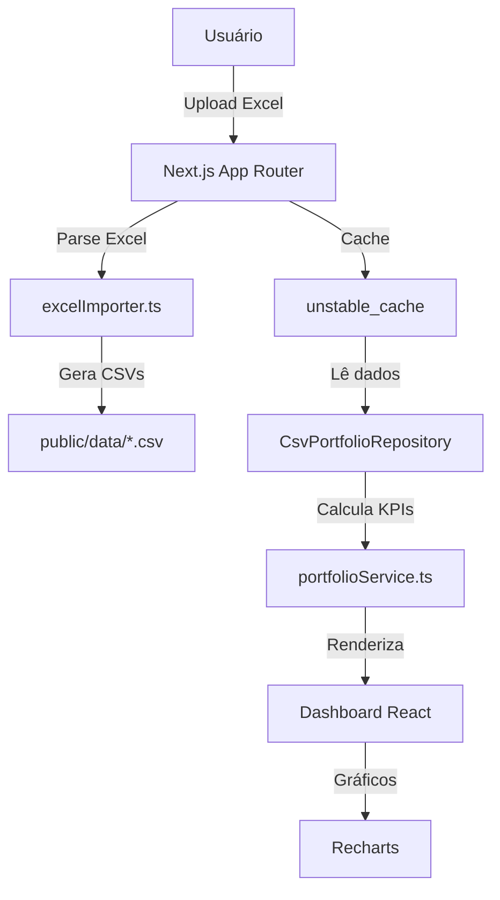

# GerInvest 📈


> Plataforma de gerenciamento de carteira de investimentos com importação de planilhas Excel e visualização interativa de posições.

## 🚀 Funcionalidades

- **Dashboard com KPIs**: Visualização de patrimônio total, número de posições, tickers únicos, contas e instituições
- **Gráficos Interativos**: Alocação por classe de ativo e instituição usando Recharts
- **Tabela de Posições**: Listagem paginada com filtros, ordenação e botão para edição manual
- **Importação de Dados**: Upload de planilhas Excel do Google Drive, conversão para CSVs estruturados
- **Edição Manual**: API para editar posições individuais via modal
- **Cache Otimizado**: Uso de `unstable_cache` do Next.js para performance

## 🛠️ Stack Tecnológica

| Camada | Tecnologia |
|--------|-----------|
| **Frontend** | Next.js (App Router) |
| **Linguagem** | TypeScript |
| **Estilização** | TailwindCSS |
| **Gráficos** | Recharts |
| **CSV/Excel** | csv-parse, xlsx |
| **Build** | ESLint |

## 📋 Pré-requisitos

- Node.js 18+
- npm ou yarn

## 🚀 Instalação e Execução
```bash
# 1. Clone o repositório
git clone https://github.com/blahxjr/gerinvest.git
cd gerinvest

# 2. Instale as dependências
npm install

# 3. Execute em desenvolvimento
npm run dev

# 4. Acesse http://localhost:3000
```

## ⚙️ Scripts Disponíveis

```bash
npm run dev          # Desenvolvimento com hot reload
npm run build        # Build de produção
npm run start        # Servidor de produção
npm run lint         # Verificação com ESLint
npm run db:migrate   # Migrações do banco de dados
```

## 🗂️ Estrutura do Projeto

```
gerinvest/
├── app/
│   ├── api/                    # API Routes
│   │   ├── auth/               # Autenticação
│   │   ├── positions/          # CRUD de posições
│   │   ├── upload-positions/   # Upload de arquivos
│   │   └── ...
│   ├── ativos/                 # Gestão de ativos
│   ├── clientes/               # Gestão de clientes
│   ├── contas/                 # Gestão de contas
│   ├── importacao/             # Página de importação
│   ├── posicoes/               # Página de posições
│   ├── login/                  # Autenticação
│   ├── page.tsx                # Dashboard principal
│   └── layout.tsx
│
├── src/
│   ├── core/                   # Lógica de negócio
│   │   ├── domain/             # Tipos e entidades
│   │   └── services/           # Serviços
│   ├── infra/                  # Infraestrutura
│   │   ├── csv/                # Processamento de CSV
│   │   └── repositories/       # Persistência
│   └── ui/components/          # Componentes React
│
├── public/data/                # CSVs gerados
├── docs/                       # Documentação técnica
├── package.json
├── tsconfig.json
├── next.config.ts
└── README.md
```

## 📡 Arquitetura



**Fluxo Principal:**
1. Usuário faz upload de planilha Excel
2. `excelImporter` converte para CSVs estruturados
3. `CsvPortfolioRepository` carrega os dados
4. `portfolioService` calcula alocações e métricas
5. Dashboard exibe KPIs e gráficos com Recharts
6. Edições manuais via API atualizam os CSVs

## � Armazenamento de Dados

**Atual:**
- CSV em `public/data/` para posições
- `.env.local` para variáveis locais

**Planejado:**
- PostgreSQL para histórico e auditoria
- NextAuth.js para autenticação multi-usuário

## 🔐 Segurança

- Middleware Next.js para proteção de rotas
- Validação com Zod
- Tipagem TypeScript em tempo de compilação

## 🚢 Build e Deploy

```bash
npm run build   # Build de produção (.next/)
npm run start   # Servidor de produção
```

Pronto para deploy em:
- Vercel (recomendado)
- Docker
- Railway, Render ou similar

## 📚 Documentação Adicional

- [GETTING_STARTED.md](docs/GETTING_STARTED.md) — Guia para desenvolvedores novos
- [ARCHITECTURE.md](docs/ARCHITECTURE.md) — Arquitetura técnica e decisões
- [API.md](docs/API.md) — Referência de endpoints
- [DOMAIN_MODEL.md](docs/DOMAIN_MODEL.md) — Modelo de domínio

## 🗺️ Roadmap

- [ ] Autenticação com NextAuth.js
- [ ] Integração com PostgreSQL para histórico
- [ ] APIs externas (cotações em tempo real)
- [ ] Relatórios e análises avançadas
- [ ] Interface mobile responsiva

## 🤝 Contribuindo

1. Fork o projeto
2. Crie uma feature branch (`git checkout -b feature/minha-feature`)
3. Commit as mudanças (`git commit -am 'feat: adiciona minha feature'`)
4. Push para a branch (`git push origin feature/minha-feature`)
5. Abra um Pull Request

## 📄 Licença

Este projeto é licenciado sob a MIT License — veja [LICENSE](LICENSE) para detalhes.

---

**Desenvolvido com ❤️ para investidores brasileiros**
