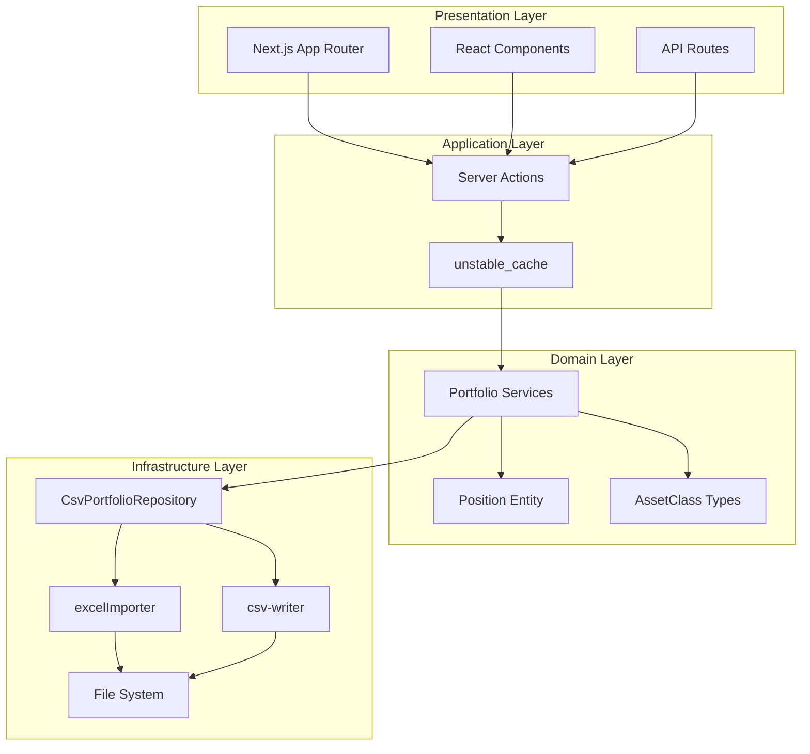
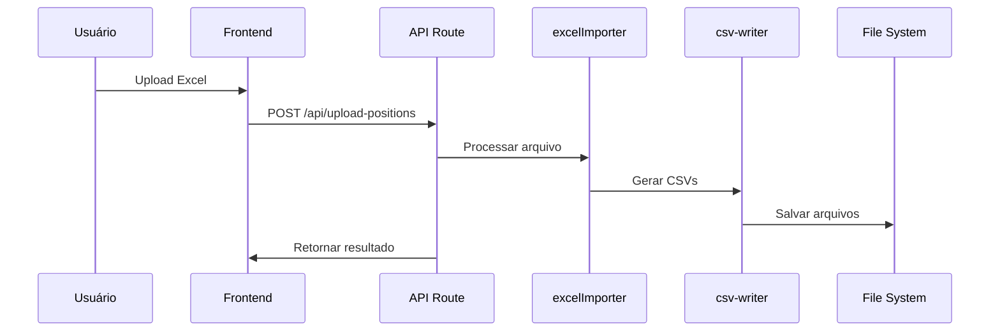
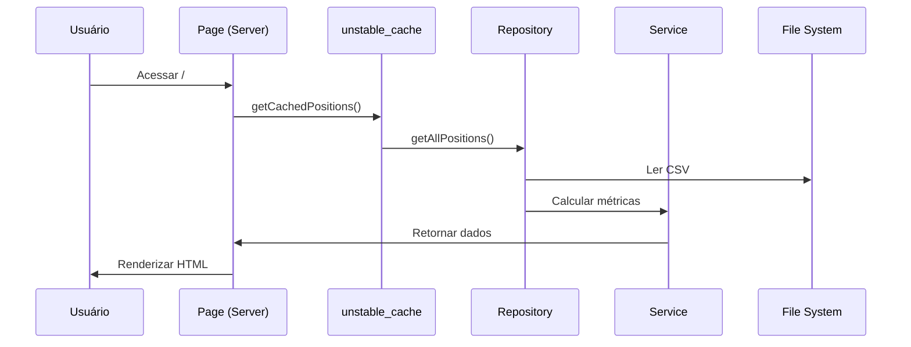

# Arquitetura do Sistema — GerInvest

> Visão técnica da arquitetura em camadas, padrões de design e decisões tomadas.

## 🏛️ Visão Geral da Arquitetura

O GerInvest segue uma **arquitetura em camadas** inspirada em Domain-Driven Design (DDD) e Clean Architecture, com separação clara entre:

- **Domínio** (regras de negócio)
- **Infraestrutura** (I/O, bancos, APIs)
- **Apresentação** (UI, APIs)

## 📊 Diagrama de Arquitetura



## 🧱 Camadas Detalhadas

### 1. Presentation Layer (Apresentação)

**Responsabilidades:**
- Renderização de UI
- Gerenciamento de estado local
- Chamadas para Server Actions
- Validação de formulários

**Tecnologias:**
- Next.js 16 (App Router)
- React 19 (Server Components)
- TailwindCSS 4
- Recharts 3.8.1

**Padrões:**
- Server Components para dados
- Client Components apenas para interatividade
- Componentes funcionais com hooks

### 2. Application Layer (Aplicação)

**Responsabilidades:**
- Coordenação entre camadas
- Cache de dados
- Validação de entrada
- Tratamento de erros

**Implementações:**
- `unstable_cache` do Next.js
- Server Actions
- Middleware de validação

### 3. Domain Layer (Domínio)

**Responsabilidades:**
- Regras de negócio puras
- Entidades e value objects
- Serviços de domínio
- Cálculos financeiros

**Conteúdo:**
- `src/core/domain/position.ts` — Entidade Position
- `src/core/domain/types.ts` — Tipos e enums
- `src/core/services/portfolioService.ts` — Lógica de cálculo

**Princípios:**
- Funções puras (sem side effects)
- Imutabilidade
- Type safety total

### 4. Infrastructure Layer (Infraestrutura)

**Responsabilidades:**
- Acesso a dados externos
- Implementações concretas
- Adaptação de interfaces

**Componentes:**
- `CsvPortfolioRepository` — Leitura/escrita CSV
- `excelImporter` — Parsing Excel
- `csv-writer` — Geração de CSVs

## 🔄 Fluxos de Dados

### Fluxo de Importação



### Fluxo de Dashboard



## 🎯 Padrões de Design Utilizados

### Repository Pattern

```typescript
// Interface abstrata
interface PortfolioRepository {
  getAllPositions(): Promise<Position[]>;
  updatePosition(id: string, data: Partial<Position>): Promise<Position>;
}

// Implementação concreta
class CsvPortfolioRepository implements PortfolioRepository {
  async getAllPositions(): Promise<Position[]> {
    // Lê de CSV
  }
}
```

**Benefícios:**
- Separação de concerns
- Testabilidade
- Facilita mudança de storage

### Service Layer

```typescript
// Serviços puramente funcionais
export function getAllocationByAssetClass(positions: Position[]) {
  return positions.reduce((acc, pos) => {
    // Lógica pura de agrupamento
  }, {} as Record<AssetClass, number>);
}
```

**Benefícios:**
- Funções puras e testáveis
- Reutilizáveis
- Sem dependências externas

### Factory Pattern (para importers)

```typescript
// Fábrica de importers
function createImporter(fileType: 'excel' | 'csv') {
  switch (fileType) {
    case 'excel': return new ExcelImporter();
    case 'csv': return new CsvImporter();
  }
}
```

## 🗄️ Estratégia de Dados

### Armazenamento Atual (CSV)

**Vantagens:**
- Simples e rápido para prototipagem
- Fácil debug e versionamento
- Não requer banco de dados
- Compatível com Excel/Google Sheets

**Desvantagens:**
- Não escalável para múltiplos usuários
- Sem concorrência/transações
- Dificulta queries complexas

### Migração Planejada (PostgreSQL)

```sql
-- Estrutura futura
CREATE TABLE positions (
  id UUID PRIMARY KEY,
  user_id UUID REFERENCES users(id),
  ticker VARCHAR(10) NOT NULL,
  asset_class VARCHAR(50) NOT NULL,
  quantity DECIMAL(15,4),
  price DECIMAL(15,4),
  gross_value DECIMAL(15,2),
  created_at TIMESTAMP DEFAULT NOW(),
  updated_at TIMESTAMP DEFAULT NOW()
);

CREATE INDEX idx_positions_user_ticker ON positions(user_id, ticker);
```

**Benefícios:**
- Multi-usuário
- ACID transactions
- Queries complexas
- Histórico/auditoria

## 🔒 Segurança

### Validação em Camadas

1. **Client-side**: Zod schemas em formulários
2. **API Routes**: Validação de entrada
3. **Domain**: Regras de negócio

### Proteções Implementadas

- Middleware Next.js para rotas
- Sanitização de file uploads
- Type safety com TypeScript
- Validação de CSVs

## 🚀 Performance

### Otimizações Atuais

- **Server Components**: HTML direto do servidor
- **unstable_cache**: Cache de 60s
- **Static Generation**: Páginas sem dados dinâmicos
- **Code Splitting**: Automatic com Next.js

### Métricas Monitoradas

- Tempo de resposta das páginas
- Taxa de cache hit/miss
- Tamanho dos bundles
- Performance do parsing CSV

## 🔮 Evolução Planejada

### Fase 2: Autenticação
- Adicionar NextAuth.js
- Firebase Auth integration
- Middleware de autorização

### Fase 3: Banco de Dados
- Migração para PostgreSQL
- Repository pattern completo
- Migrations com controle de versão

### Fase 4: APIs Externas
- Integração Brapi
- Google Sheets API
- Webhooks para atualizações

## 📚 Referências

- [Clean Architecture](https://blog.cleancoder.com/uncle-bob/2012/08/13/the-clean-architecture.html)
- [Domain-Driven Design](https://dddcommunity.org/)
- [Next.js App Router](https://nextjs.org/docs/app)
- [TypeScript Handbook](https://www.typescriptlang.org/docs/)

---

*Atualizado: Março 2026*